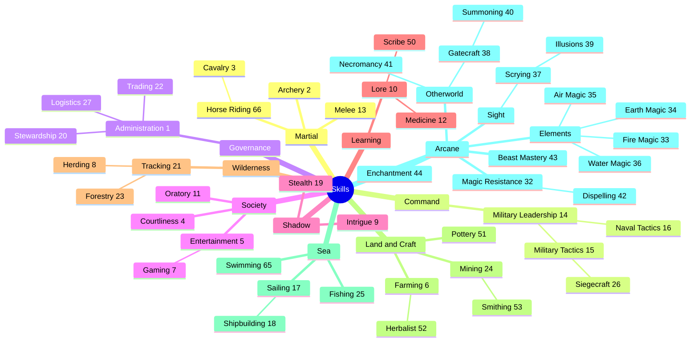

# Skill tree

This arranges the T'Nyc skills as a tree. The [skill reference](skills.md)
groups them by function and number; this view groups them by what kind of
competence they are and which skills build on which.

It is an exploration, not a rule. Nothing here changes how skills are learned,
numbered, or priced. See "What the tree could mean" at the end for mechanics a
tree might support if we decide we want them.

## How to read it

- **Branches** (plain names, no number) are families of competence. They are
  not skills and cannot be studied.
- **Skills** show their skill number, for example `Melee [13]`.
- **A skill under another skill** builds on its parent: it is a narrower or
  more advanced use of the same competence. Cavalry under Horse Riding is the
  one case the rules state outright (rules 3.32.2).
- Every skill appears exactly once. Relationships the tree cannot show are
  listed under "Cross-links".

## Tree

```text
Skills
├── Martial
│   ├── Melee [13]
│   ├── Archery [2]
│   └── Horse Riding [66]
│       └── Cavalry [3]
├── Command
│   └── Military Leadership [14]
│       ├── Military Tactics [15]
│       │   └── Siegecraft [26]
│       └── Naval Tactics [16]
├── Governance
│   └── Administration [1]
│       ├── Stewardship [20]
│       ├── Logistics [27]
│       └── Trading [22]
├── Society
│   ├── Courtliness [4]
│   ├── Oratory [11]
│   └── Entertainment [5]
│       └── Gaming [7]
├── Shadow
│   ├── Stealth [19]
│   └── Intrigue [9]
├── Learning
│   └── Lore [10]
│       ├── Scribe [50]
│       └── Medicine [12]
├── Wilderness
│   └── Tracking [21]
│       ├── Forestry [23]
│       └── Herding [8]
├── Land and Craft
│   ├── Farming [6]
│   │   └── Herbalist [52]
│   ├── Mining [24]
│   │   └── Smithing [53]
│   └── Pottery [51]
├── Sea
│   ├── Swimming [65]
│   ├── Fishing [25]
│   └── Sailing [17]
│       └── Shipbuilding [18]
└── Arcane
    ├── Magic Resistance [32]
    │   └── Dispelling [42]
    ├── Elements
    │   ├── Fire Magic [33]
    │   ├── Earth Magic [34]
    │   ├── Air Magic [35]
    │   └── Water Magic [36]
    ├── Sight
    │   └── Scrying [37]
    │       └── Illusions [39]
    ├── Otherworld
    │   ├── Gatecraft [38]
    │   │   └── Summoning [40]
    │   └── Necromancy [41]
    ├── Enchantment [44]
    └── Beast Mastery [43]
```

## Diagram

The same tree as a Mermaid mind map, which GitHub renders.



## Why skills sit where they do

Most placements follow the skill descriptions in the rules. The less obvious
ones:

| Skill | Placed under | Reason |
|---|---|---|
| Cavalry | Horse Riding | Rules 3.32.2: Cavalry bestows Horse Riding, so riding is the foundation and mounted combat is built on it. |
| Siegecraft | Military Tactics | Taking a walled place is a tactical problem first; the engineering serves the tactics. |
| Naval Tactics | Military Leadership | It is command of troops at sea (rules 3.32.6), a sibling of Military Tactics rather than a use of Sailing. |
| Logistics | Administration | Its GURPS roots are mostly Administration, Packing, and Freight Handling. It is administration applied to armies. |
| Trading | Administration | Commerce and bookkeeping share a root. Trading could equally stand alone under Governance. |
| Gaming | Entertainment | Both are diversions that earn money in company. |
| Intrigue | Shadow | Rules 3.31.9.1 groups Intrigue with Stealth among the "slimy skills". |
| Medicine | Lore | Healing is learned knowledge; rules 3.31.7 includes magical healing, but it is not priced as magic. |
| Herding, Forestry | Tracking | Rules 3.33.6: Tracking "covers the basic woodcraft skills" and suits trapping and herding provinces. |
| Smithing | Mining | Metal comes out of the ground before it is worked. |
| Shipbuilding | Sailing | Knowing ships from the deck comes before building them. |
| Dispelling | Magic Resistance | Both counter magic. Resistance protects the holder; Dispelling acts on magic in the world. |
| Illusions | Scrying | Rules 3.34.8: only a master scryer can tell what is real, so seeing and deceiving the eye are one discipline. |
| Summoning | Gatecraft | Calling beings from elsewhere is a use of gates, as in the GURPS Gate college. |

## Cross-links

A tree gives each skill one parent. These relationships cross branches and
would matter to any mechanic built on the tree:

| Skill | Also related to | Why |
|---|---|---|
| Naval Tactics | Sailing | Commanding at sea needs a feel for ships. |
| Siegecraft | Mining | Undermining walls. |
| Logistics | Military Leadership | Supply serves the army's commander. |
| Herbalist | Medicine | Herbs are medicine's raw material. |
| Smithing | Martial | Arms and armor (the ARMOR order). |
| Beast Mastery | Herding, Horse Riding | Handling animals, magical or not. |
| Illusions | Stealth, Intrigue | The "slimy skills" (rules 3.31.9.1). |
| Scrying | Tracking, Lore | Detection (rules 3.31.9.1). |
| Water Magic, Air Magic | Sailing | Weather and seas. |
| Earth Magic | Mining | Mineral extraction (rules 3.34.3). |

## What the tree could mean

If we want the tree to have mechanics, these are the usual options, from
lightest to heaviest:

1. **Display only.** Reports and lore sheets list skills by branch. No rule
   changes.
2. **Study discount.** Studying a skill is cheaper or faster when the unit
   already has its parent, or any skill in the same branch.
3. **Defaults.** A unit without a skill can use it at a reduced level based on
   its parent, like GURPS defaults.
4. **Prerequisites.** A child skill cannot be studied until the parent reaches
   some level. This is the classic skill tree, and the one that most limits
   character building.

The Cavalry and Horse Riding rule in 3.32.2 already works like option 3 in
reverse: the child grants the parent.
